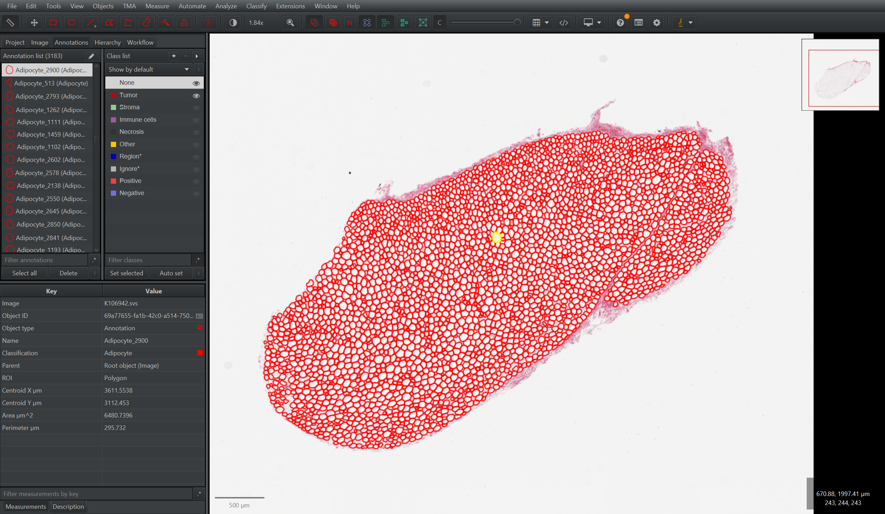
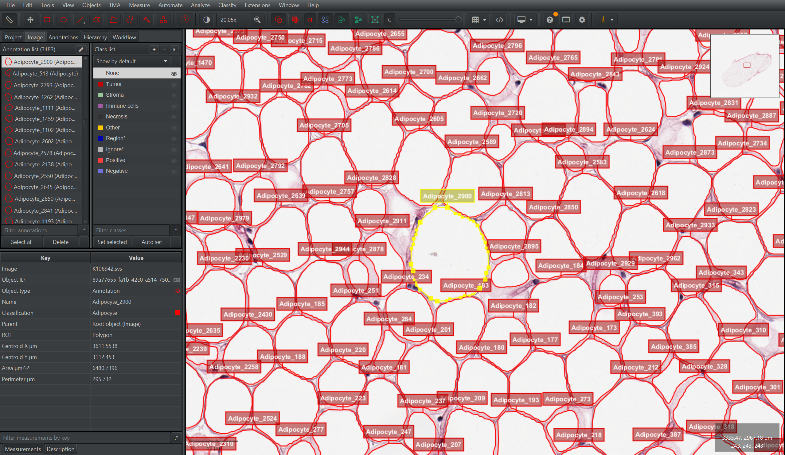
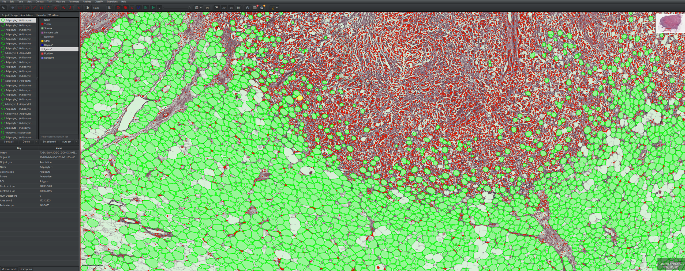
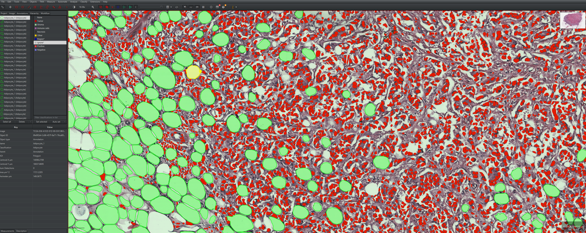

<div align="center">


### Automated Adipocyte Detection for Whole-Slide Images

[](https://www.python.org/)
[](https://pytorch.org/)
[](https://github.com/facebookresearch/detectron2)
[](https://huggingface.co/letarg/adifind)
[](LICENSE)
[](https://github.com/meidelien/adifind/actions/workflows/ci.yml)

[Features](documentation/features.md) | [QuPath Integration](#qupath-integration) | [Documentation](#documentation) | [Citation](#citation)

</div>

---

AdiFind provides automated adipocyte detection and measurement in whole-slide histology images. AdiFind uses customized Detectron2-based models for instance segmentation, tissue-guided window selection, optional tumor distance analysis, ROI-restricted processing, and QuPath-ready exports so you can move from whole-slide context to per-cell measurements without a manual annotation workflow.

<p align="center">
  
  <br/>
  <em>AdiFind can summarize whole-slide context, adipose regions, and tumor distance information in a single annotated output.</em>
</p>


What AdiFind produces:

- per-adipocyte measurements with spatial coordinates and optional tumor distances
- annotated TIFF overlays for whole-slide review
- GeoJSON adipocyte annotations for QuPath
- summary JSON files for downstream analysis and reproducibility


## QuPath Integration

AdiFind exports QuPath-ready annotations so whole-slide review, zoomed inspection, and downstream pathology workflows can continue in a tool many labs already use.

<table>
  <tr>
    <td align="center" width="50%">
      
      <br/>
      <em>Whole-slide QuPath review shows imported AdiFind annotations across the processed tissue region.</em>
    </td>
    <td align="center" width="50%">
      
      <br/>
      <em>Zoomed QuPath inspection lets you examine individual adipocytes and their stored measurements directly in context.</em>
    </td>
  </tr>
</table>


<table>
  <tr>
    <td align="center" width="50%">
      
      <br/>
      <em>Whole-slide QuPath review shows imported AdiFind annotations(light green) across the processed tissue region.</em>
    </td>
    <td align="center" width="50%">
      
      <br/>
      <em>AdiFind also interoperates with existing QuPath workflows, here exemplified with StarDist nuclei segmentation(red dots).</em>
    </td>
  </tr>
</table>


## Documentation

<div align="center">

| Do you want to... | Go here |
|:-------------|:--------|
| Install AdiFind | [Installation Guide](documentation/INSTALL.md) |
| Run your first analysis | [Quick Start](documentation/getting-started.md) |
| Process slides from the CLI | [Command Line Interface](documentation/cli-workflows.md) |
| Understand tissue guidance, tumor analysis, GUI, and ROI workflows | [Features and Workflows](documentation/features.md) |
| Review outputs in QuPath | [QuPath Integration](documentation/qupath-integration.md) |
| Work from Python or Jupyter | [Python API](documentation/python-api.md) and [Quickstart notebook](notebooks/quickstart.ipynb) |
| Understand what image formats AdiFind supports | [Supported File Formats](documentation/supported_file_formats.md) |
| Configure model paths, cache, and runtime defaults | [Configuration](documentation/configuration.md) |
| Deploy with Docker or on HPC | [Deployment](documentation/deployment.md) |

</div>

Browse the full documentation portal at [documentation](documentation/index.md).

<details>
<summary>Advanced and reference pages</summary>

- [CLI reference](documentation/cli-reference.md)
- [Output reference](documentation/output-reference.md)
- [Performance tuning](documentation/performance-tuning.md)
- [Architecture](documentation/architecture.md)
- [Troubleshooting](documentation/troubleshooting.md)
- [Contributing](documentation/contributing.md)

</details>

## Citation

If you use AdiFind in your research/work, please cite:

```bibtex
@software{adifind2026,
  title = {Computer vision quantification of tumour-adipocyte architecture across obesity-associated cancers predicts breast cancer outcome},
  author = {Lien, Martin Eide and Hartel, Gunter and Tran, Khoa A and Waddell, Nicola, Brownrigg, Sunniva S, Bouttle, Kelsie and O'Mara, Tracy and Halberg, Nils},
  year = {2026},
  url = {https://github.com/meidelien/adifind}
}
```

## License

This project is licensed under the MIT License. See [LICENSE](LICENSE) for details.

<div align="center">

**Questions?** [Open an issue](https://github.com/meidelien/adifind/issues) | **Contributing?** See [Contributing](documentation/contributing.md)

</div>
