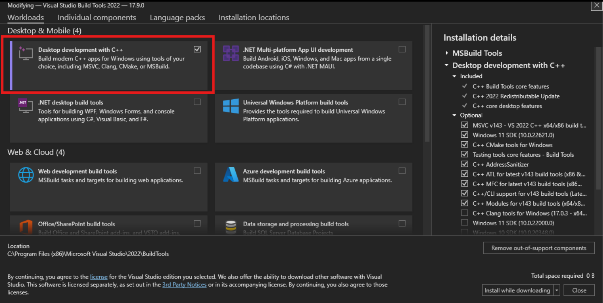

# AdiFind Installation Guide

Three installation tracks are supported. Choose the one that fits your environment.

For a first-run walkthrough after setup, see [Quick Start](getting-started.md). For the full docs map, see [Documentation Index](index.md).

| Track | Best for |
|-------|----------|
| **A. Conda** (recommended) | Local workstations, laptops |
| **B. Docker** | Reproducible containers, cloud VMs |
| **C. Apptainer / Singularity** | Academic HPC clusters |

## Which section should I use?

| If you are installing on... | Start here |
|-----------------------------|------------|
| Linux workstation or laptop | [Track A1: Linux Conda Install (Recommended)](#track-a1-linux-conda-install-recommended) |
| Windows| [Track A2: Windows Conda Install](#track-a2-windows-conda-install) |
| Docker or cloud VM | [Track B: Docker](#track-b-docker) |
| HPC cluster | [Track C: Apptainer / Singularity (HPC)](#track-c-apptainer--singularity-hpc) |
| Custom pip environment | [Manual Installation (pip)](#manual-installation-pip) |

> **Model access:** the Hugging Face model repository is currently private. Auto-download works only for authenticated users right now. For no-token installs, use local canonical checkpoint files named `adifind_adipocyte.pth`, `adifind_tumor.pth`, and `adifind_tissue_guidance.pth`. Once the repo is public, the same auto-download path will work without authentication.

---

## Track A: Conda Environment

The Conda path installs Python 3.10, PyTorch and torchvision with the repo's CUDA 12.1 package selection, OpenSlide Python bindings, NumPy/SciPy/Pandas/scikit-image/OpenCV/tifffile/Matplotlib/tqdm, Jupyter support, Detectron2 from Git, Hugging Face Hub, and editable AdiFind.

Both convenience scripts resolve the repository root automatically, check for `conda` and `git`, and run lightweight post-install validation after creating the environment.

### Track A1: Linux Conda Install (Recommended)

Use this path for a normal Linux workstation, laptop, or Linux VM.

#### Linux prerequisites

- [Miniconda](https://docs.anaconda.com/miniconda/) or [Anaconda](https://www.anaconda.com/download)
- [Git](https://git-scm.com/downloads), required because `environment.yml` installs Detectron2 from a Git URL
- Optional: an NVIDIA driver if you want CUDA/GPU inference

Confirm both commands are available:

```bash
conda --version
git --version
```

#### Linux install steps

Clone the repository and run the Linux install script:

```bash
git clone https://github.com/meidelien/adifind.git
cd adifind
bash install.sh
```

When the script completes, activate the environment:

```bash
conda activate adifind
```

#### Linux validation

The install script already runs these checks. You can rerun them manually from the repository root. These validation commands do not require AdiFind model files or Hugging Face access.

```bash
python -c "import torch; print(f'PyTorch {torch.__version__}, CUDA: {torch.cuda.is_available()}')"
python -c "import detectron2; print(f'Detectron2 {detectron2.__version__}')"
python -c "import openslide; print(f'OpenSlide {openslide.__library_version__}')"
python -c "import openslide; slide = openslide.OpenSlide('example_data/K106942.svs'); print(slide.dimensions); slide.close()"
adifind --help
python code/main.py --help
adifind example_data/K106942.svs --tissue_guidance --dry_run
python code/main.py example_data/K106942.svs --tissue_guidance --dry_run
```

`--dry_run` is the preferred validation command because it verifies repo-root pathing and entrypoint wiring without requiring model download or inference.

After validation, continue with [Quick Start](getting-started.md).

#### Linux direct Conda alternative

If you prefer not to use the script, run these equivalent Conda commands instead:

```bash
git clone https://github.com/meidelien/adifind.git
cd adifind
conda env create -f environment.yml
conda activate adifind
```

Then run the [Linux validation](#linux-validation) commands above.

### Track A2: Windows Conda Install

Use this path if you want to run AdiFind locally on Windows without Docker.

#### Windows prerequisites

- [Miniconda](https://docs.anaconda.com/miniconda/) or [Anaconda](https://www.anaconda.com/download)
- [Git for Windows](https://git-scm.com/download/win)
- [Visual Studio 2022 Build Tools](https://visualstudio.microsoft.com/downloads/), or Visual Studio 2022 with [Desktop development with C++](https://visualstudio.microsoft.com/vs/cplusplus/)
- An [NVIDIA driver](https://www.nvidia.com/en-us/drivers/) if you want GPU inference

In the Visual Studio installer, select the [Desktop development with C++](https://visualstudio.microsoft.com/vs/cplusplus/) workload:



[Visual Studio 2022 Build Tools](https://visualstudio.microsoft.com/downloads/) with the [Desktop development with C++](https://visualstudio.microsoft.com/vs/cplusplus/) workload is required so Detectron2 can build correctly when the Conda environment installs it from Git.

These prerequisites matter because `environment.yml` currently creates the Conda environment and then pip-installs Detectron2 from Git. On Windows, that Detectron2 step needs Git plus a working C++ build toolchain.

#### Windows install steps

From `cmd.exe`:

```cmd
git clone https://github.com/meidelien/adifind.git
cd adifind
install.bat
```

From PowerShell:

```powershell
git clone https://github.com/meidelien/adifind.git
cd adifind
.\install.bat
```

`install.bat` is a thin wrapper around `conda env create -f environment.yml`, so it has the same Windows prerequisites as the direct Conda command.

When the script completes, activate the environment:

```bash
conda activate adifind
```

#### Windows validation

The install script already runs these checks. You can rerun them manually from the repository root. These validation commands do not require AdiFind model files or Hugging Face access.

```bash
python -c "import torch; print(f'PyTorch {torch.__version__}, CUDA: {torch.cuda.is_available()}')"
python -c "import detectron2; print(f'Detectron2 {detectron2.__version__}')"
python -c "import openslide; print(f'OpenSlide {openslide.__library_version__}')"
python -c "import openslide; slide = openslide.OpenSlide('example_data/K106942.svs'); print(slide.dimensions); slide.close()"
adifind --help
python code/main.py --help
adifind example_data/K106942.svs --tissue_guidance --dry_run
python code/main.py example_data/K106942.svs --tissue_guidance --dry_run
```

If `import openslide` fails on Windows because the DLLs are not being found automatically, download OpenSlide from the [OpenSlide download page](https://openslide.org/download/) and set `OPENSLIDE_PATH` before rerunning the verification commands:

```powershell
$env:OPENSLIDE_PATH = "C:\OpenSlide\bin"
```

```cmd
set "OPENSLIDE_PATH=C:\OpenSlide\bin"
```

If you want to use local model directories or an authenticated [Hugging Face](https://huggingface.co/docs/huggingface_hub/main/en/guides/cli) download on Windows, use the PowerShell or `cmd.exe` examples in [Model Configuration](#model-configuration).

#### Windows fallback if Detectron2 source build fails

If `conda env create -f environment.yml` fails while building Detectron2 on Windows, stay on the non-Docker path and switch to [Manual Installation (pip)](#manual-installation-pip) below.

For that fallback, install a prebuilt Detectron2 wheel that matches the PyTorch and CUDA stack you selected. The current example in this page is for PyTorch `cu121` with a `torch 2.1` wheel source:

```bash
pip install detectron2 -f https://dl.fbaipublicfiles.com/detectron2/wheels/cu121/torch2.1/index.html
```

If you choose a different PyTorch or CUDA combination, use the matching Detectron2 wheel instead of the `cu121` example above.

### Developer verification

`pytest` is not installed by the base Conda environment. If you want the repo smoke tests:

```bash
pip install -e ".[dev]"
python -m pytest -p no:debugging code/test_smoke.py -v --tb=short -x
```

---

## Track B: Docker

### Prerequisites

- [Docker](https://docs.docker.com/get-docker/)
- [NVIDIA Container Toolkit](https://docs.nvidia.com/datacenter/cloud-native/container-toolkit/install-guide.html) if you want the CUDA/NVIDIA GPU image

### Build

From the repository root:

```bash
docker build -t adifind:gpu -f docker/Dockerfile .
docker build -t adifind:cpu -f docker/Dockerfile.cpu .
```

### Optional bundled model layout

If you want checkpoints baked into the image, place them under `docker/models/` before building:

```text
docker/models/
|- adipocyte/adifind_adipocyte.pth
|- tumor/adifind_tumor.pth
`- tissue/adifind_tissue_guidance.pth
```

Legacy checkpoint filenames are not supported.

### Run

```bash
docker run --rm --gpus all \
    -v /path/to/slides:/data/input:ro \
    -v /path/to/output:/data/output \
    adifind:gpu /data/input/slide.svs \
    --output_dir /data/output --tissue_guidance
```

CPU only:

```bash
docker run --rm \
    -v /path/to/slides:/data/input:ro \
    -v /path/to/output:/data/output \
    adifind:cpu /data/input/slide.svs \
    --output_dir /data/output --tissue_guidance
```

### Compose

```bash
cd docker
docker compose build adifind-gpu
docker compose build adifind-cpu
docker compose run --rm adifind-gpu /data/input/slide.svs --output_dir /data/output --tissue_guidance
docker compose run --rm adifind-cpu /data/input/slide.svs --output_dir /data/output --tissue_guidance
```

### Verification

These validation commands do not require AdiFind model files or Hugging Face access.

```bash
docker run --rm adifind:cpu --help
docker run --rm adifind:gpu --help
docker run --rm --entrypoint python adifind:gpu -c "import openslide; print(openslide.__library_version__)"
docker run --rm --entrypoint python -v /path/to/slides:/data/input:ro adifind:cpu -c "import openslide; slide = openslide.OpenSlide('/data/input/K106942.svs'); print(slide.dimensions); slide.close()"
docker run --rm --entrypoint python -v /path/to/slides:/data/input:ro adifind:gpu -c "import openslide; slide = openslide.OpenSlide('/data/input/K106942.svs'); print(slide.dimensions); slide.close()"
docker run --rm --gpus all \
    -v /path/to/slides:/data/input:ro \
    -v /path/to/output:/data/output \
    adifind:gpu /data/input --output_dir /data/output --tissue_guidance --dry_run
```

Mounted or explicit model directories must contain the canonical filenames only. See [docker/README.md](../docker/README.md) for details.

---

## Track C: Apptainer / Singularity (HPC)

For academic HPC clusters where Docker is not available.

### Build

```bash
apptainer build adifind.sif docker/adifind.def
```

### Run

GPU:

```bash
apptainer run --nv \
    --bind /path/to/slides:/data \
    --bind /path/to/output:/output \
    adifind.sif /data/slide.svs \
    --output_dir /output --tissue_guidance
```

CPU:

```bash
apptainer run \
    --bind /path/to/slides:/data \
    --bind /path/to/output:/output \
    adifind.sif /data/slide.svs \
    --output_dir /output --tissue_guidance --disable_gpu_accel
```

### Shared cache for offline nodes

Run the pre-cache step only on a machine that has internet access and Hugging Face access to the model repo.

```bash
export ADIFIND_CACHE_DIR=/shared/project/adifind_models
apptainer exec adifind.sif python -c "from model_downloader import ensure_all_models; ensure_all_models()"
```

On compute nodes, bind the same cache location and reuse it:

```bash
export ADIFIND_CACHE_DIR=/shared/project/adifind_models

apptainer run --nv \
    --bind /shared/project/adifind_models:/shared/project/adifind_models \
    --bind /path/to/slides:/data \
    --bind /path/to/output:/output \
    adifind.sif /data/slide.svs \
    --output_dir /output --tissue_guidance
```

If you set `ADIFIND_*_MODEL_DIR` explicitly inside Apptainer, those directories must contain the canonical `adifind_*` filenames only.

### Verification

These validation commands do not require AdiFind model files or Hugging Face access.

```bash
apptainer run adifind.sif --help
apptainer exec --bind /path/to/slides:/data adifind.sif python -c "import openslide; slide = openslide.OpenSlide('/data/K106942.svs'); print(slide.dimensions); slide.close()"
apptainer run --nv \
    --bind /path/to/slides:/data \
    --bind /path/to/output:/output \
    adifind.sif /data --output_dir /output --tissue_guidance --dry_run
```

---

## Manual Installation (pip)

Use this advanced path if you prefer to manage dependencies yourself, or if Track A fails during the Detectron2 source-build step on Windows.

### Manual Linux pip install

Use this path for a custom Linux Python environment instead of the recommended Conda install. This path requires Python 3.9+, Git, and a Linux build toolchain suitable for Detectron2 source builds.

#### 1. Clone the repository

```bash
git clone https://github.com/meidelien/adifind.git
cd adifind
```

#### 2. Create and activate a Python environment

```bash
python3 --version
python3 -m venv .venv
source .venv/bin/activate
python -m pip install --upgrade pip
```

#### 3. Install OpenSlide

On Debian or Ubuntu:

```bash
sudo apt-get update
sudo apt-get install openslide-tools libopenslide0
```

Use your distribution's package manager for equivalent OpenSlide packages on other Linux distributions.

#### 4. Install PyTorch

Choose one PyTorch command for your machine:

```bash
# CUDA 12.1
pip install torch torchvision --index-url https://download.pytorch.org/whl/cu121

# CUDA 11.8
pip install torch torchvision --index-url https://download.pytorch.org/whl/cu118

# CPU only
pip install torch torchvision --index-url https://download.pytorch.org/whl/cpu
```

#### 5. Install Detectron2 and AdiFind

```bash
pip install 'git+https://github.com/facebookresearch/detectron2.git'
pip install -e .
```

#### 6. Validate the Linux pip install

These validation commands do not require AdiFind model files or Hugging Face access.

```bash
python -c "import torch; print(f'PyTorch {torch.__version__}, CUDA: {torch.cuda.is_available()}')"
python -c "import detectron2; print(f'Detectron2 {detectron2.__version__}')"
python -c "import openslide; print(f'OpenSlide {openslide.__library_version__}')"
python -c "import openslide; slide = openslide.OpenSlide('example_data/K106942.svs'); print(slide.dimensions); slide.close()"
adifind --help
python code/main.py example_data/K106942.svs --tissue_guidance --dry_run
```

### Manual Windows pip install

Use this path only if the Windows Conda install fails or if you are managing your own Python environment.

#### 1. Confirm Python

```bash
python --version
```

#### 2. Clone the repository

```cmd
git clone https://github.com/meidelien/adifind.git
cd adifind
```

#### 3. Install OpenSlide

1. Download from the [OpenSlide download page](https://openslide.org/download/)
2. Extract it, for example to `C:\OpenSlide`
3. If needed, set `OPENSLIDE_PATH` before running AdiFind:

```powershell
$env:OPENSLIDE_PATH = "C:\OpenSlide\bin"
```

```cmd
set "OPENSLIDE_PATH=C:\OpenSlide\bin"
```

#### 4. Install PyTorch, Detectron2, and AdiFind

Choose the PyTorch command that matches your CUDA or CPU setup:

```bash
# CUDA 12.1
pip install torch torchvision --index-url https://download.pytorch.org/whl/cu121

# CUDA 11.8
pip install torch torchvision --index-url https://download.pytorch.org/whl/cu118

# CPU only
pip install torch torchvision --index-url https://download.pytorch.org/whl/cpu
```

Install a prebuilt Detectron2 wheel that matches the PyTorch and CUDA stack you selected. This example is for PyTorch `cu121` with a `torch 2.1` wheel source:

```bash
pip install detectron2 -f https://dl.fbaipublicfiles.com/detectron2/wheels/cu121/torch2.1/index.html
pip install -e .
```

Treat the `cu121` example as one matching combination, not as a universal command.

### Optional pip dependencies

```bash
pip install cupy-cuda12x
pip install slideio
pip install -e ".[notebook]"
```

---

## Model Configuration

By default, AdiFind uses the canonical checkpoints from Hugging Face and caches them locally when download access is available. The current Hugging Face repo is private, so unauthenticated users should point AdiFind at local canonical checkpoint directories instead.

Set only the variables you need for your setup.

### Windows PowerShell

```powershell
$env:ADIFIND_ADIPOCYTE_MODEL_DIR = "C:\path\to\adipocyte"
$env:ADIFIND_TUMOR_MODEL_DIR = "C:\path\to\tumor"
$env:ADIFIND_TISSUE_MODEL_DIR = "C:\path\to\tissue"
$env:ADIFIND_CACHE_DIR = "C:\path\to\cache"
$env:ADIFIND_HF_REPO = "your-org/your-model-repo"
$env:HF_TOKEN = "your-hugging-face-token"
```

### Windows `cmd.exe`

```cmd
set "ADIFIND_ADIPOCYTE_MODEL_DIR=C:\path\to\adipocyte"
set "ADIFIND_TUMOR_MODEL_DIR=C:\path\to\tumor"
set "ADIFIND_TISSUE_MODEL_DIR=C:\path\to\tissue"
set "ADIFIND_CACHE_DIR=C:\path\to\cache"
set "ADIFIND_HF_REPO=your-org/your-model-repo"
set "HF_TOKEN=your-hugging-face-token"
```

### Linux

```bash
export ADIFIND_ADIPOCYTE_MODEL_DIR=/path/to/adipocyte
export ADIFIND_TUMOR_MODEL_DIR=/path/to/tumor
export ADIFIND_TISSUE_MODEL_DIR=/path/to/tissue
export ADIFIND_CACHE_DIR=/path/to/cache
export ADIFIND_HF_REPO=your-org/your-model-repo
export HF_TOKEN=your-hugging-face-token
```

Each directory must contain the canonical filename for that model:

- adipocyte: `adifind_adipocyte.pth`
- tumor: `adifind_tumor.pth`
- tissue guidance: `adifind_tissue_guidance.pth`

Legacy checkpoint filenames are not supported.

---

## Troubleshooting

### OpenSlide not found (Windows)

Symptom: `ImportError: OpenSlide library not found` or `DLL load failed`

1. Download OpenSlide from the [OpenSlide download page](https://openslide.org/download/)
2. Extract it to `C:\OpenSlide`, or note the folder that contains the `bin` directory with the DLLs.
3. Set `OPENSLIDE_PATH` for your current shell session:

```powershell
$env:OPENSLIDE_PATH = "C:\OpenSlide\bin"
```

```cmd
set "OPENSLIDE_PATH=C:\OpenSlide\bin"
```

4. If your environment is still missing the Python bindings, install them:

```bash
conda install -c conda-forge openslide-python
```

5. Restart your terminal or IDE session and rerun:

```bash
python -c "import openslide; print(openslide.__library_version__)"
```

### GPU Docker OpenSlide build conflicts

The GPU Docker and Apptainer images intentionally avoid Conda OpenSlide packages inside the `pytorch/pytorch` base image. They use pip-installed `openslide-bin` instead, which avoids the base-image Conda solver conflicts while still providing OpenSlide at runtime.

### CUDA out of memory

```bash
adifind slide.svs --batch_size 2
adifind slide.svs --low_memory --memmap_mask
```

### Detectron2 build errors on Windows

`environment.yml` currently installs Detectron2 from Git, so Windows source builds require both [Git for Windows](https://git-scm.com/download/win) and a working Visual Studio C++ toolchain.

If `conda env create -f environment.yml` fails during that step:

1. Confirm that [Git for Windows](https://git-scm.com/download/win) is installed and available on `PATH`.
2. Confirm that [Visual Studio 2022 Build Tools](https://visualstudio.microsoft.com/downloads/), or Visual Studio with [Desktop development with C++](https://visualstudio.microsoft.com/vs/cplusplus/), is installed.
3. Retry the Conda environment creation.
4. If you still want a Windows native install without Docker, switch to the manual `pip` path above and install a prebuilt Detectron2 wheel that matches your PyTorch and CUDA selection.

Example for a PyTorch `cu121` / `torch 2.1` combination:

```bash
pip install detectron2 -f https://dl.fbaipublicfiles.com/detectron2/wheels/cu121/torch2.1/index.html
```

Use a different Detectron2 wheel when your PyTorch or CUDA selection is different. For more detail, see [Troubleshooting](troubleshooting.md#detectron2-build-fails-windows).

### Missing `pkg_resources`

If an existing install fails with `ModuleNotFoundError: No module named 'pkg_resources'`, install a compatible setuptools version:

```bash
python -m pip install "setuptools<82"
```

This is a Detectron2 compatibility issue with recent setuptools releases, not a model-weights or slide-format issue. New installs from the provided environment and container files already include this guard.

### Model download fails (private Hugging Face repo / firewall / proxy)

The Hugging Face model repo is currently private, so unauthenticated download failures are expected.

To keep a native install working without Docker:

- set `HF_TOKEN` or run `huggingface-cli login` using the [Hugging Face CLI auth docs](https://huggingface.co/docs/huggingface_hub/main/en/guides/cli) if you have access to the repo and a [user access token](https://huggingface.co/settings/tokens)
- or place the canonical checkpoint files in local model directories and set `ADIFIND_*_MODEL_DIR`

Required canonical filenames:

- `adifind_adipocyte.pth`
- `adifind_tumor.pth`
- `adifind_tissue_guidance.pth`

Legacy checkpoint filenames are not supported. For shell-specific examples, use the commands in [Model Configuration](#model-configuration). For additional background, see [Configuration](configuration.md#openslide-on-windows) and [Troubleshooting](troubleshooting.md).
